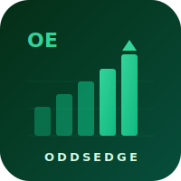
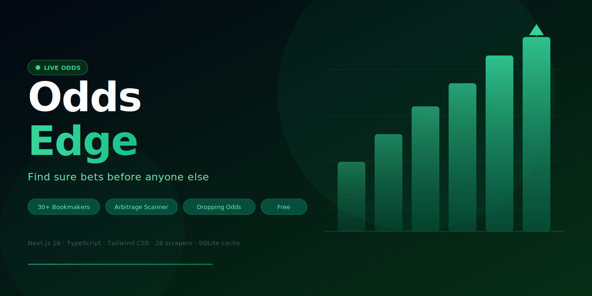

<div align="center">
  
  <h1>OddsEdge</h1>
  <p><strong>Find sure bets before anyone else</strong></p>

  <p>
    
    
    
    
    
  </p>

  
</div>

---

## Overview

**OddsEdge** is a real-time sports betting intelligence platform that scrapes and aggregates live odds from **30+ bookmakers** worldwide. It automatically detects arbitrage (sure bet) opportunities, tracks dropping odds signals, and provides a clean interface for comparing markets — completely free, no sign-up required.

---

## Features

| Feature | Description |
|---|---|
| **Arbitrage Scanner** | Detects sure bets across bookmakers where the sum of implied probabilities is < 100% |
| **Dropping Odds** | Tracks significant odds movements as early market signals |
| **Odds Comparison** | Side-by-side comparison of all bookmaker prices for any event |
| **Sports Schedule** | Upcoming fixtures across soccer, basketball, tennis, MMA, and more |
| **Sports News** | Aggregated news feed relevant to active markets |
| **28 Scrapers** | Independent scrapers run concurrently with deduplication and odds merging |
| **SQLite Cache** | In-process database caching for low-latency repeated requests |
| **Prediction Markets** | Supports Kalshi and Polymarket alongside traditional sportsbooks |

---

## Bookmaker Coverage

<details>
<summary><strong>UK & Ireland (8)</strong></summary>

Betfair · William Hill · Sky Bet · Paddy Power · Coral · Ladbrokes · BetVictor · Betfred
</details>

<details>
<summary><strong>Europe (6)</strong></summary>

Kambi (Betsson, Unibet) · Pinnacle · bwin · Betway · Unibet · Marathonbet
</details>

<details>
<summary><strong>United States (5)</strong></summary>

DraftKings · FanDuel · BetMGM · Caesars · Bovada
</details>

<details>
<summary><strong>Australia (3)</strong></summary>

Sportsbet · TAB AU · Ladbrokes AU
</details>

<details>
<summary><strong>Data Aggregators (3)</strong></summary>

Sofascore · Action Network · OddsPortal
</details>

<details>
<summary><strong>Prediction Markets (2)</strong></summary>

Kalshi · Polymarket
</details>

---

## Sports Supported

Soccer · Basketball · Tennis · Hockey · Baseball · American Football · MMA · Cricket · Rugby · Golf · Horse Racing · Greyhound Racing · Motorsport · Esports · Prediction Markets

---

## Tech Stack

| Layer | Technology |
|---|---|
| Framework | Next.js 16 (App Router) |
| Language | TypeScript 5 |
| Styling | Tailwind CSS v4 |
| UI Components | Radix UI + shadcn/ui |
| Scraping | Cheerio + native `fetch` |
| Caching | better-sqlite3 (in-process SQLite) |
| Testing | Vitest |
| Odds Source (optional) | The Odds API (free tier) |

---

## Getting Started

### Prerequisites

- Node.js 18+
- npm / yarn / pnpm

### Installation

```bash
git clone https://github.com/Ross-Ward/oddsedge.git
cd oddsedge
npm install
```

### Environment Variables

Copy `.env.local.example` to `.env.local`:

```bash
cp .env.local.example .env.local
```

```env
# Optional — The Odds API free key (500 req/month)
# Get one at https://the-odds-api.com/
# Leave blank to use the 28 scrapers as the sole data source.
ODDS_API_KEY=
```

### Run Development Server

```bash
npm run dev
```

Open [http://localhost:3000](http://localhost:3000).

---

## Project Structure

```
app/
  page.tsx                  # Home — hero, sports tabs, top sure bets
  sure-bets/                # Arbitrage opportunities browser
  odds/                     # Live odds comparison table
  dropping-odds/            # Odds movement signals
  schedule/                 # Upcoming fixtures
  news/                     # Sports news feed
  api/
    arbitrage/              # GET /api/arbitrage
    dropping-odds/          # GET /api/dropping-odds
    events/                 # GET /api/events
    news/                   # GET /api/news
    scraper-status/         # GET /api/scraper-status

lib/
  scrapers/                 # 28 independent bookmaker scrapers
  arbitrage.ts              # Sure-bet detection algorithm
  aggregator.ts             # Concurrent scraper orchestration + dedup
  cache.ts                  # SQLite caching layer
  types.ts                  # Shared TypeScript types

components/
  home/                     # Landing page sections
  sure-bets/                # Arbitrage UI cards
  schedule/                 # Fixtures grid
  layout/                   # Header & footer
  ui/                       # Shared primitives (Button, Card, Badge…)
```

---

## How Arbitrage Detection Works

For each event and market, OddsEdge collects the **best available odds** for every outcome across all bookmakers:

```
implied_prob = Σ (1 / bestOdds[i])

If implied_prob < 1.0  →  sure bet exists
profit% = (1 / implied_prob - 1) × 100
```

Stakes are calculated proportionally so any outcome wins the same guaranteed return.

---

## Running Tests

```bash
npm test              # run all tests once
npm run test:watch    # watch mode
npm run test:coverage # coverage report
```

---

## License

MIT — free to use, modify, and deploy.
